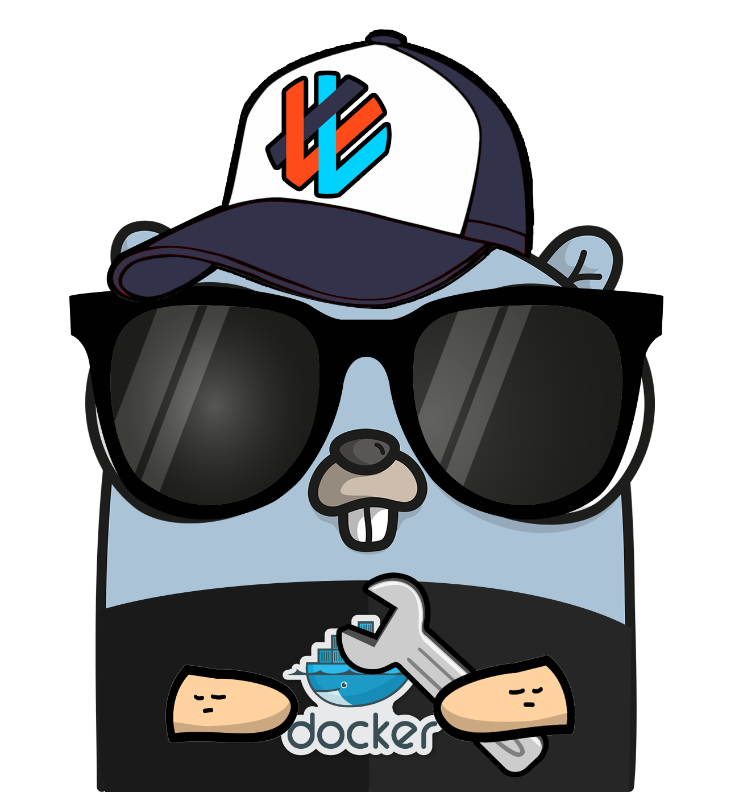

<div>
    
    
</div>

# go-micro-core


A library of interfaces and implementations for common microservices patterns for different Cloud platforms.

## Overview

`go-micro-core` is a toolkit designed to simplify the development of microservices in the cloud. This library provides a wide array of interfaces and implementations, making it easier to build, manage, and deploy microservices without the usual verbosity and boilerplate code. With `go-micro-core`, you can focus on the business logic of your applications while leveraging proven patterns and practices for cloud-native development.

## Features

- **Configuration Management**: Simplifies loading and managing configurations from various sources.
- **Database Integration**: Provides a consistent interface for interacting with different databases.
- **Error Handling**: Centralized error management to handle and log errors effectively.
- **Logging**: Structured logging support to keep track of your application's behavior.
- **Messaging**: Interfaces for integrating with different messaging systems.
- **Microservice Patterns**: Common patterns and utilities for building resilient and scalable microservices.
- **Platform Abstraction**: Abstracts the underlying cloud platform specifics to provide a uniform development experience.
- **Profiling and Monitoring**: Tools for profiling and monitoring the performance of your services.
- **Server Management**: Utilities for managing the lifecycle of your servers.
- **Graceful Shutdown**: Ensures that your services can shutdown gracefully, preserving data integrity.
- **Utilities and Validators**: Handy utilities and validators to reduce boilerplate code and ensure data integrity.

## Installation

To install `go-micro-core`, use the following command:

```sh
go get github.com/marcodd23/go-micro-core
```

## Usage
Here's a basic example to get you started:

```go

package main

import (
	"context"
	"github.com/gofiber/fiber/v2"
	"github.com/marcodd23/go-micro-core/pkg/configmgr"
	"github.com/marcodd23/go-micro-core/pkg/database"
	"github.com/marcodd23/go-micro-core/pkg/database/pgdb"
	"github.com/marcodd23/go-micro-core/pkg/logmgr"
	"github.com/marcodd23/go-micro-core/pkg/servermgr/fibersrv"
	"github.com/marcodd23/go-micro-core/pkg/shutdown"
	"log"
	"sync"
	"time"
)

// ShutdownTimeoutMilli - timeout for cleaning up resources before shutting down the server.
const ShutdownTimeoutMilli = 500

type ServiceConfig struct {
	configmgr.BaseConfig `mapstructure:",squash"`
	CustomProperty       string `mapstructure:"custom-property"`
}

func main() {
	rootCtx := context.Background()

	config := loadConfiguration()

	logmgr.SetupLogger(config)

	db := setupDatabase(rootCtx, config, []database.PreparedStatement{})

	serverManager := fibersrv.NewFiberServer(config)

	// Setup Routes
	serverManager.Setup(rootCtx, func(appServer *fiber.App) {
		appServer.Group("/api")
		appServer.Get("/", func(c *fiber.Ctx) error {

			go func() {
				db.QueryAndProcess(c.Context(), 0, func(row database.Row, rowScan database.RowScan) error {
					logmgr.GetLogger().LogInfo(rootCtx, "Process each row of the ResultSet")

					return nil
				},`SELECT MESSAGE_ID, ENTITY_NAME, ENTITY_KEY, EVENT_PAYLOAD, MODIFY_TS
						FROM EVENT_LOG
						ORDER BY MESSAGE_ID`)
			}()

			return c.SendString("Process Started")
		})
	})

	// Start server
	serverManager.RunAsync()

	// ######### MAIN APPLICATION CODE
	wg := sync.WaitGroup{}
	appCtx, cancelAppCtx := context.WithCancel(rootCtx)
	defer cancelAppCtx()

	InfinitePolling(appCtx, &wg)
	// ###################################

	shutdown.WaitForShutdown(rootCtx, ShutdownTimeoutMilli, func(timeoutCtx context.Context) {
		serverManager.Shutdown(timeoutCtx)
		cancelAppCtx()
		wg.Wait()
	})

}

func InfinitePolling(appCtx context.Context, wg *sync.WaitGroup) {
	go func(ctx context.Context) {
		wg.Add(1)
		defer wg.Done()

		// Implement a infinite loop that just log a string, and will terminate only if the context is cancelled
		ticker := time.NewTicker(1 + time.Second)
		defer ticker.Stop()

		for {
			select {
			case <-ctx.Done():
				logmgr.GetLogger().LogInfo(ctx, "Context cancelled, exiting goroutine")
				return
			case <-ticker.C:
				logmgr.GetLogger().LogInfo(ctx, "Logging from infinite loop...")
			}
		}
	}(appCtx)
}

func loadConfiguration() *ServiceConfig {
	var cfg ServiceConfig

	err := configmgr.LoadConfigFromPathForEnv("./examples/", &cfg)
	if err != nil {
		log.Panicf("error loading property files: %+v", err)
	}

	return &cfg
}

// setupDatabase - Setup Database
func setupDatabase(
	ctx context.Context,
	appConfig *ServiceConfig,
	preparesStatements []database.PreparedStatement) database.InstanceManager {
	aclDBConf := database.ConnConfig{
		VpcDirectConnection: false,
		IsLocalEnv:          appConfig.IsLocalEnvironment(),
		Host:                "",
		Port:                5432,
		DBName:              "",
		User:                "",
		Password:            "",
		MaxConn:             10,
	}

	return pgdb.SetupPostgresDB(ctx, aclDBConf, preparesStatements...)
}
```

## Contributing
Currently, this project is maintained and developed by a single contributor. If you have any suggestions, feedback, or ideas, feel free to open an issue or submit a pull request.

## License
This project is licensed under the MIT License - see the LICENSE file for details

